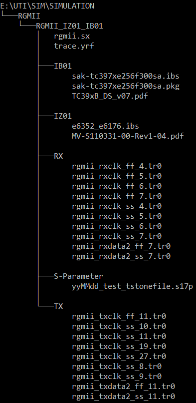

# SpyceGen
Last updated: 7 November 2019

## USAGE
```
python spyce_gen.py -h // Help: for description and a list of flags
python spyce_gen.py -p PATH -t TEMPLATE // These two flags are REQUIRED
```

## I. Purpose
SpyceGen is a program designed to generate scripts to operate Synopys's HSPICE printed-circuit board (PCB) simulation program (https://www.synopsys.com/content/dam/synopsys/verification/datasheets/hspice-ds.pdf).

Thus, the program aims to automate a particular step in PCB simulation, which until now, is conducted manual by tedious, error-prone copy-pasting.

## II. Background
SpyceGen was intended to solve bottlenecks of a specific workflow that involves using outputs from Anysys SIwave as inputs for Synopsys HSPICE. As such, for the program to satisfy its Purpose, the initial directory path must, in one or more of its subdirectories, contain at least one *touchstone* file.

Additionally, though not directly used in SpyceGen, the overall workflow may require files with the following extensions:
* .tr0
* .pkg
* .ibs

## III. Inputs
### 1. PATH (-p/--path)
At its current stage, directory structure is essential for SpyceGen to function.
Specifically, the input path **must** have a structure like the following:

**Fig III.1 Structure of PATH**



Here, the *root directory* is passed as an argument to the program at execution (marked by the flag -p/--path), wherein:
1. The root folder must be named *Simulation*.
2. One or more *subdirectories*, such as `RGMII_IZ01_IB01` here. (This may become optional in the future).
3. The *S-Parameter* folder must contain the touchstone file, whose file extension must match the regex pattern `\.s\d+p$` .
4. *IB01* and *IZ01* are optional, arbitrarily named folders (in this example, they were named according to the driver and receiver of the target net). 
More important, however, is the existence of the `.ibs` and `.pkg` files within them, which, though not critical to the function of SpyceGen, will influence the ultimate simulation outputs.
4. *RX* and *TX* are optional. If absent, these folders are automatically generated to store the output script files.
5. Files other than those described above may be critical to the ultimate simulation outputs, though their existence and location within the directory are not relevant to the function of SpyceGen.

### 2. TEMPLATE (-t/--template) 
All produced scripts are based on a template file, the contents of which are edited by SpyceGen to reflect parameters extracted from other files in the directory. The template should be a text file.

## IV. Outputs
### HSPICE script files
After `main()` runs, each subdirectory in the root directory `Simulation` will have an `RX` and `TX` folder; each of these will contain the completed HSPICE scripts (file extension `.sp`). 

The user can expect a fast (ff), slow (ss), and typical (typ) version of each signal (e.g., clk or data) in their corresponding `RX` and `TX` folders. 

## V. Current Limitations and Plans
SpyceGen requires a specific directory structure while making assumptions about file structures that present functional limits in edge cases. While unit tests pass, further integrated and end-to-end testing of such cases can address these limitations.

Besides refactoring for greater reusability, there are plans to implement a GUI for greater usability.

Contributions to make this project more widely applicable are always welcome.