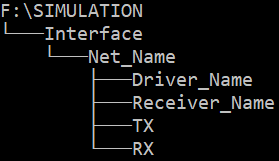

SpyceGen.py
===
```
Author: Rahul D. GHOSAL
Date: 2 January 2020
```
## 1. Purpose
Automate the generation of writing scripts used in HSPICE simulation via the input of Simulation directory with a particular structure.

## 2. Usage
### 1. Installation
```bash
# To install as an editable package
pip install -e spyce_gen
```
### 2. Setup
In order to use SpyceGen, a Simulation folder of the following structure is necessary.

**Fig 2.1 Folder Structure**



### 3. Execution
```bash
# Help menu
spyce-gen -h

# Execute
# NOTE: For Windows-style paths, paths must be surrounded by quotation marks
spyce-gen <Simulation FOLDER PATH> <template.txt PATH>
```

## 3. TODO
1. Code edit such that TX/RX names are input via the user rather than automatically
2. Code edit such that there are more applicable interfaces (developed based on RGMII)